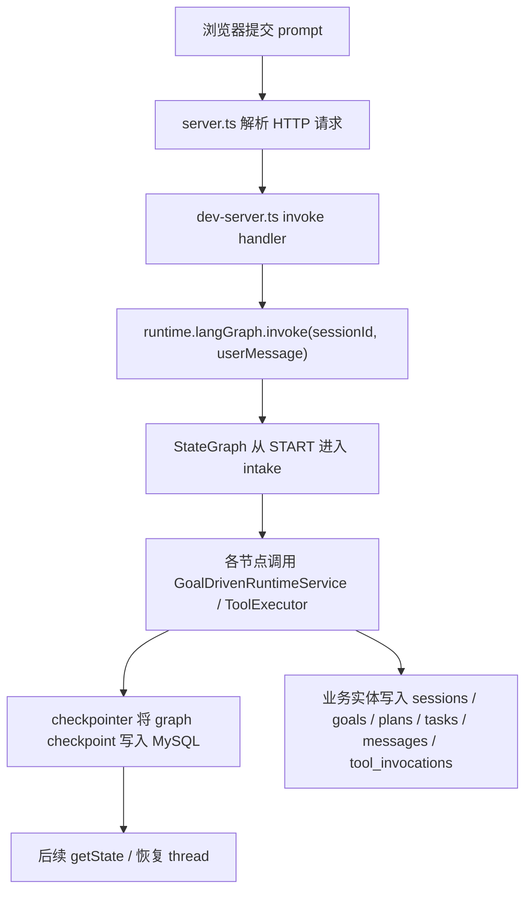

# LangGraph 专项阅读手册

这份文档只讲一件事：`LangGraph` 在这个项目里到底是什么、怎么接进来的、有哪些接口和方法、每一层代码具体在哪。

目标读者是假设你现在还不懂 LangGraph，需要：

- 自己顺着代码看懂
- 面试时能讲清楚
- 分清楚哪些是 LangGraph 官方概念，哪些是本项目自己写的适配层

## 1. 先用一句话讲明白：LangGraph 是什么

如果你以前只写过“请求进来 -> 调一下模型 -> 把结果存起来”这种链路，那 LangGraph 可以先理解成：

> 一个把 agent 执行流程显式建模成“状态 + 节点 + 边 + checkpoint”的编排框架。

它关心的不是“模型是哪家”，而是：

- 当前这轮执行处在哪个节点
- 这张图在节点之间传什么状态
- 节点之间怎么跳
- 中途停了以后怎么恢复
- 同一个 thread 的历史 checkpoint 怎么保存和读取

在这个项目里，LangGraph 主要负责：

- 把 `intake -> clarify -> plan -> delegate -> execute -> review -> summarize -> continue-or-close` 这条主链串起来
- 用 `thread_id = sessionId` 把一次 session 对齐成一条可恢复的 graph thread
- 借助 checkpointer 把 graph state 落到 MySQL

它**不负责**：

- 直接操作数据库业务实体
- 直接改文件
- 直接决定 tool policy
- 直接实现 session / goal / plan / task 的生命周期

这些事情仍然是项目自己的 runtime / service / tooling 层在做。

## 2. 这个项目里，LangGraph 相关代码总览

先把地图列出来。你第一遍看不要乱跳文件，按这个顺序读。

### 2.1 最核心的 7 个文件

1. `packages/runtime/src/graph.ts`
2. `packages/runtime/src/langgraph.ts`
3. `packages/db/src/langgraph-checkpointer.ts`
4. `apps/ide-web/src/bootstrap.ts`
5. `apps/ide-web/src/dev-server.ts`
6. `apps/ide-web/src/minimax.ts`
7. `packages/db/sql/001_initial_schema.sql`

### 2.2 每个文件分别负责什么

- `packages/runtime/src/graph.ts`
  负责定义 runtime 的 workflow 合同和 graph state 结构。
- `packages/runtime/src/langgraph.ts`
  负责把 workflow 合同真正接成一张 LangGraph 图。
- `packages/db/src/langgraph-checkpointer.ts`
  负责把 LangGraph checkpoint / pending writes 持久化到 MySQL。
- `apps/ide-web/src/bootstrap.ts`
  负责把 service、toolExecutor、checkpointer 和 graph 组装起来。
- `apps/ide-web/src/dev-server.ts`
  负责把浏览器 prompt 真正送进 `runtime.langGraph.invoke(...)`。
- `apps/ide-web/src/minimax.ts`
  负责把 MiniMax 适配成 `LangGraphHooks`。
- `packages/db/sql/001_initial_schema.sql`
  负责定义 LangGraph durable execution 需要的数据库表。

## 3. LangGraph 官方概念，在本项目里分别落在哪

这一节最重要，因为面试官一问你“LangGraph 是什么”，你不能把自己写的接口错当成框架 API。

### 3.1 `Annotation.Root`

代码位置：

- `packages/runtime/src/langgraph.ts:99-110`

作用：

- 定义整张图在节点之间传递的 state schema
- 指定某些字段如何合并，比如 `executionLog` 用 reducer 追加

本项目里具体声明了这些字段：

- `sessionId`
- `userMessage`
- `runtimeState`
- `latestReview`
- `latestPlanId`
- `latestSubagentRunId`
- `executionLog`

对应代码：

- `packages/runtime/src/langgraph.ts:99-114`

面试时可以这样说：

“我用 `Annotation.Root` 把 graph 的状态边界显式声明出来，而不是在节点函数之间随手传一个 object。这样做的好处是状态结构稳定、可检查、也更利于 checkpoint 恢复。”

### 3.2 `StateGraph`

代码位置：

- `packages/runtime/src/langgraph.ts:914-936`

作用：

- 创建一张真正可运行的状态图
- 用 `addNode(...)` 注册节点
- 用 `addEdge(...)` 注册边
- 用 `compile(...)` 编译成可 invoke 的图

本项目里这张图的节点是：

- `intake`
- `clarify`
- `plan`
- `delegate`
- `execute`
- `review`
- `summarize`
- `continue-or-close`

### 3.3 `START` / `END`

代码位置：

- `packages/runtime/src/langgraph.ts:923-931`

作用：

- `START` 表示图的入口
- `END` 表示图的出口

本项目当前主链是固定边：

- `START -> intake`
- `intake -> clarify`
- `clarify -> plan`
- `plan -> delegate`
- `delegate -> execute`
- `execute -> review`
- `review -> summarize`
- `summarize -> continue-or-close`
- `continue-or-close -> END`

这件事很重要，因为它直接说明当前 runtime 还不是“完全动态分支路由”。

### 3.4 `compile(...)`

代码位置：

- `packages/runtime/src/langgraph.ts:932-936`

本项目传入了：

- `checkpointer`
- `name`
- `description`

这里的 `checkpointer` 就是 durable execution 的关键，它来自：

- `apps/ide-web/src/bootstrap.ts:92-97`
- `packages/db/src/langgraph-checkpointer.ts:174-354`

### 3.5 `invoke(...)`

代码位置：

- `packages/runtime/src/langgraph.ts:944-957`
- 实际调用入口：`apps/ide-web/src/dev-server.ts:57-60`

本项目里 `invoke(...)` 最关键的配置是：

- `configurable.thread_id = input.sessionId`

也就是说：

> 本项目把 `LangGraph thread` 直接等价成 `Session`

这是非常值得讲的设计点，因为它让：

- graph 恢复语义
- session 恢复语义
- checkpoint 查询语义

三者统一起来了。

### 3.6 `getState(...)` / `StateSnapshot`

代码位置：

- `packages/runtime/src/langgraph.ts:959-965`

作用：

- 读取某个 `thread_id` 当前的 LangGraph 快照

注意它和数据库里的业务 state 不是一回事。

`StateSnapshot` 更偏：

- 当前图运行到哪
- Annotation 里有哪些值
- 调试 graph thread

它**不等于**“完整业务账本”，完整业务账本还是要看 `RuntimeStore` 和 MySQL 里的实体。

### 3.7 `BaseCheckpointSaver`

代码位置：

- `packages/db/src/langgraph-checkpointer.ts:1-14`

作用：

- LangGraph 官方定义的 checkpoint 持久化抽象

本项目自定义实现是：

- `PersistentLangGraphCheckpointSaver`
  - `packages/db/src/langgraph-checkpointer.ts:174-354`

## 4. 本项目自己定义的 LangGraph 适配层接口

这一节是你项目自己的设计，不是 LangGraph 官方 API。

### 4.1 `LangGraphInvokeInput`

代码位置：

- `packages/runtime/src/langgraph.ts:24-27`

字段：

- `sessionId`
- `userMessage?`

作用：

- 定义一次 graph invoke 需要的最小输入

### 4.2 `LangGraphGoalDraft`

代码位置：

- `packages/runtime/src/langgraph.ts:29-33`

字段：

- `title`
- `description`
- `successCriteria`

作用：

- `goalFactory` 节点输出的结构化目标草案

### 4.3 `LangGraphExecuteResult`

代码位置：

- `packages/runtime/src/langgraph.ts:35-41`

字段：

- `executionPhase?`
- `assistantMessage?`
- `tasks?`
- `memory?`
- `toolCalls?`

作用：

- `executor` 节点返回的统一结构化执行草案

### 4.4 `LangGraphExecutionPhase`

代码位置：

- `packages/runtime/src/langgraph.ts:43`

取值：

- `explain`
- `modify`
- `finalize`

作用：

- 把 mixed explain + edit 请求拆成明确相位

### 4.5 `LangGraphToolCall`

代码位置：

- `packages/runtime/src/langgraph.ts:45-50`

字段：

- `name`
- `input`
- `taskId?`
- `reasoning?`

作用：

- executor 向 runtime 请求真实工具调用的统一格式

### 4.6 `LangGraphHooks`

代码位置：

- `packages/runtime/src/langgraph.ts:52-91`

这是项目里最重要的 provider 适配合同。

它定义了 6 个 hook：

- `goalFactory`
- `planner`
- `delegate`
- `executor`
- `reviewer`
- `summarizer`

每个 hook 都只负责“返回结构化 JSON”，不直接碰数据库和文件系统。

### 4.7 `LangGraphRuntimeOptions`

代码位置：

- `packages/runtime/src/langgraph.ts:93-97`

字段：

- `hooks?`
- `checkpointer`
- `toolExecutor?`

作用：

- 把 graph 运行所需依赖收成一个统一入口

### 4.8 `AgentLangGraphState` / `AgentLangGraphUpdate`

代码位置：

- `packages/runtime/src/langgraph.ts:112-114`

来源：

- `typeof AgentLangGraphAnnotation.State`
- `typeof AgentLangGraphAnnotation.Update`

作用：

- 给节点函数的输入 / 输出提供准确类型

### 4.9 `AgentLangGraphRuntime`

代码位置：

- `packages/runtime/src/langgraph.ts:941-970`

方法：

- `invoke(input)`
- `getThreadState(sessionId)`
- `getCompiledGraph()`

这不是 LangGraph 官方类，而是项目自己的包装器。

它的价值是：

- 让上层依赖“自己的 runtime API”
- 避免 controller / server 直接依赖 LangGraph 细节

## 5. `packages/runtime/src/graph.ts` 到底在干什么

这个文件不是 LangGraph 官方文件，但它定义了 graph 需要承载的业务合同。

### 5.1 `WorkflowNode`

代码位置：

- `packages/runtime/src/graph.ts:16-24`

### 5.2 `GraphMessage`

代码位置：

- `packages/runtime/src/graph.ts:28-33`

### 5.3 `GraphCheckpoint`

代码位置：

- `packages/runtime/src/graph.ts:37-43`

### 5.4 `GraphToolInvocation`

代码位置：

- `packages/runtime/src/graph.ts:48-59`

### 5.5 `AgentGraphState`

代码位置：

- `packages/runtime/src/graph.ts:63-77`

这是 `runtimeState` 的核心业务快照。

包含：

- `workspaceId`
- `session`
- `activeGoal`
- `currentPlan?`
- `tasks`
- `messages`
- `toolInvocations`
- `memory`
- `activeAgent`
- `activePolicy`
- `subagentRuns`
- `pendingReview?`
- `checkpoints`

### 5.6 `CORE_WORKFLOW`

代码位置：

- `packages/runtime/src/graph.ts:81-90`

### 5.7 `ALLOWED_TRANSITIONS`

代码位置：

- `packages/runtime/src/graph.ts:99-108`

这是一张 workflow contract 表。

它很重要，但要诚实：

- 它描述了允许的跳转关系
- 但当前运行时真正执行的边，还是 `packages/runtime/src/langgraph.ts:923-931` 里的固定 `.addEdge(...)`

### 5.8 `canTransitionTo(...)`

代码位置：

- `packages/runtime/src/graph.ts:110-112`

目前它是辅助校验函数，还没有被当前图的运行时路由真正消费。

## 6. `packages/runtime/src/langgraph.ts` 里的所有核心方法

### 6.1 辅助方法

代码位置：

- `packages/runtime/src/langgraph.ts:116-436`

最重要的几个：

- `logLine(...)`
- `stableSerialize(...)`
- `buildToolCallKey(...)`
- `readToolCallPath(...)`
- `hasExplicitViewRange(...)`
- `readExplicitViewRangeKey(...)`
- `inferExecutionPhase(...)`
- `prepareToolInput(...)`
- `summarizeToolResult(...)`
- `persistWorkflowCheckpoint(...)`
- `refreshRuntimeState(...)`
- `createDefaultSummary(...)`

### 6.2 `createAgentLangGraph(...)`

代码位置：

- `packages/runtime/src/langgraph.ts:441-939`

入参：

- `service: GoalDrivenRuntimeService`
- `options: LangGraphRuntimeOptions`

返回：

- `AgentLangGraphRuntime`

### 6.3 每个节点方法

#### `intakeNode`

代码位置：

- `packages/runtime/src/langgraph.ts:449-490`

作用：

- 写入用户消息
- 必要时调用 `goalFactory`
- 刷新 `runtimeState`
- 写 checkpoint

#### `clarifyNode`

代码位置：

- `packages/runtime/src/langgraph.ts:492-498`

当前还是最小占位实现。

#### `planNode`

代码位置：

- `packages/runtime/src/langgraph.ts:500-539`

作用：

- 调 `hooks.planner(...)`
- 调 `service.savePlan(...)`

#### `delegateNode`

代码位置：

- `packages/runtime/src/langgraph.ts:541-583`

作用：

- 调 `hooks.delegate(...)`
- 调 `service.delegateToSubagent(...)`

#### `executeNode`

代码位置：

- `packages/runtime/src/langgraph.ts:585-823`

这是全项目最复杂的一段。

它本质上是一个 `tool-use control loop`：

1. 调 `hooks.executor(...)`
2. 同步 `tasks`
3. 同步 `memory`
4. 如果有 `toolCalls`，就走真实 `toolExecutor.execute(...)`
5. 把工具结果写回 `tool` message 和 `toolInvocations`
6. 刷新 `runtimeState`
7. 继续下一轮，直到没有新的工具调用或到达轮数上限

这里最值得重点看的执行纪律有：

- `executionPhase`
- duplicate tool loop guard
- view reread budget
- mixed explain + modify continuation policy

#### `reviewNode`

代码位置：

- `packages/runtime/src/langgraph.ts:825-871`

#### `summarizeNode`

代码位置：

- `packages/runtime/src/langgraph.ts:873-904`

#### `closeNode`

代码位置：

- `packages/runtime/src/langgraph.ts:906-912`

## 7. `packages/db/src/langgraph-checkpointer.ts` 到底实现了什么

这是项目里 LangGraph durability 的关键文件。

### 7.1 项目自己的持久化抽象

代码位置：

- `packages/db/src/langgraph-checkpointer.ts:25-68`

这里定义了：

- `SerializedCheckpointRecord`
- `SerializedCheckpointWriteRecord`
- `LangGraphCheckpointRepository`

### 7.2 `PersistentLangGraphCheckpointSaver`

代码位置：

- `packages/db/src/langgraph-checkpointer.ts:174-354`

它实现了 LangGraph saver 需要的核心方法：

- `getTuple(...)`
  - 位置：`179-222`
  - 用于恢复某个线程 / 某个 checkpoint
- `list(...)`
  - 位置：`224-274`
  - 用于枚举 checkpoint
- `put(...)`
  - 位置：`276-307`
  - 用于保存 checkpoint 主体
- `putWrites(...)`
  - 位置：`309-335`
  - 用于保存 pending writes
- `deleteThread(...)`
  - 位置：`337-339`
  - 用于删除某条 thread 的 checkpoint 数据

### 7.3 `MySqlLangGraphCheckpointRepository`

代码位置：

- `packages/db/src/langgraph-checkpointer.ts:356-539`

方法：

- `getCheckpoint(...)`
- `listCheckpoints(...)`
- `putCheckpoint(...)`
- `listWrites(...)`
- `putWrite(...)`
- `deleteThread(...)`

### 7.4 数据库表

代码位置：

- `packages/db/sql/001_initial_schema.sql:134-159`

表：

- `langgraph_checkpoints`
- `langgraph_checkpoint_writes`

## 8. MiniMax 是怎么接到 LangGraph 上的

### 8.1 入口

代码位置：

- `apps/ide-web/src/minimax.ts:1102-1285`

关键方法：

- `createMiniMaxHooks(...)`

它返回的就是：

- `LangGraphHooks`

### 8.2 每个 hook 对应哪个 graph 节点

- `goalFactory`
  - `apps/ide-web/src/minimax.ts:1111-1134`
- `planner`
  - `apps/ide-web/src/minimax.ts:1135-1157`
- `delegate`
  - `apps/ide-web/src/minimax.ts:1158-1193`
- `executor`
  - `apps/ide-web/src/minimax.ts:1194-1242`
- `reviewer`
  - `apps/ide-web/src/minimax.ts:1243-1263`
- `summarizer`
  - `apps/ide-web/src/minimax.ts:1264-1283`

### 8.3 `callMiniMaxJson(...)`

代码位置：

- `apps/ide-web/src/minimax.ts:943-1072`

这个方法非常重要，因为它说明项目不是“盲信模型输出”。

它做了三层处理：

1. JSON 提取
2. 语法修复
3. sanitizer + Zod schema 校验 + schema repair

## 9. 从浏览器 prompt 到 LangGraph 落库的完整链路

### 9.1 HTTP 边界

代码位置：

- `apps/ide-web/src/server.ts:134-260`

### 9.2 真正进入 LangGraph 的地方

代码位置：

- `apps/ide-web/src/dev-server.ts:47-65`

关键调用：

- `runtime.langGraph.invoke({ sessionId, userMessage: input.prompt })`

### 9.3 组合根

代码位置：

- `apps/ide-web/src/bootstrap.ts:72-128`

这里组装了：

- `RuntimeStore`
- `GoalDrivenRuntimeService`
- `RuntimeToolExecutor`
- `createMySqlLangGraphCheckpointSaver(...)`
- `createAgentLangGraph(...)`

### 9.4 LangGraph 图执行

代码位置：

- `packages/runtime/src/langgraph.ts:449-936`

### 9.5 持久化

代码位置：

- `packages/db/src/langgraph-checkpointer.ts:174-354`
- `packages/db/sql/001_initial_schema.sql:134-159`

## 10. 当前 LangGraph 接法的真实边界

### 10.1 已经做到的

- 有真正的 `StateGraph`
- 有真正的 MySQL checkpointer
- 有 `thread_id = sessionId`
- 有真实 `invoke(...)`
- 有真实工具循环
- 有 checkpoint 持久化和恢复接口

### 10.2 还没做到的

- `ALLOWED_TRANSITIONS` 还没真正驱动 LangGraph 条件分支
- 当前图仍然是固定 `.addEdge(...)` 主链
- `clarify` 仍然是最小占位节点
- 更复杂的条件路由和更细粒度 branching 还没完全接完

## 11. 最推荐的阅读顺序

1. `packages/runtime/src/graph.ts:16-112`
2. `packages/runtime/src/langgraph.ts:24-114`
3. `packages/runtime/src/langgraph.ts:441-970`
4. `packages/db/src/langgraph-checkpointer.ts:47-354`
5. `apps/ide-web/src/bootstrap.ts:72-128`
6. `apps/ide-web/src/dev-server.ts:32-124`
7. `apps/ide-web/src/minimax.ts:943-1285`
8. `packages/db/sql/001_initial_schema.sql:134-159`

然后再看两组测试：

1. `packages/runtime/src/langgraph.test.ts:359-980`
2. `packages/db/src/langgraph-checkpointer.test.ts:128-200`

## 12. 面试时的简洁答法

### “LangGraph 是什么？”

“我把它当成 agent workflow 的编排层。它负责节点顺序、graph state、thread checkpoint 和恢复；业务动作本身还是由我自己的 service 和 toolExecutor 实现。”

### “你这个项目里怎么用 LangGraph？”

“我用 `Annotation.Root` 定义 graph state，用 `StateGraph` 把 intake/plan/execute/review 这些节点接成主链，然后把 `thread_id` 直接对齐到 sessionId，再用自定义 MySQL checkpointer 把 checkpoint 持久化。模型供应商层通过 `LangGraphHooks` 返回结构化 JSON，真正的业务落地还是走 runtime service 和工具执行器。”

### “你最难的点是什么？”

“最难的是 execute control loop，不是图本身。因为图接起来不难，难的是 mixed explain + edit 时，怎么避免模型反复 view、不继续 edit。我后来把它拆成 execution phase、loop guard 和 budgeted reread policy，这才让 execute 从‘会调工具’变成‘有执行纪律’。”
